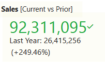
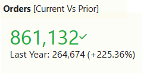
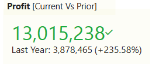
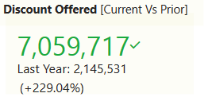
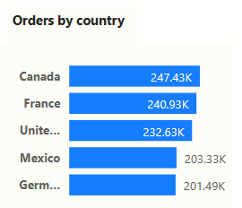
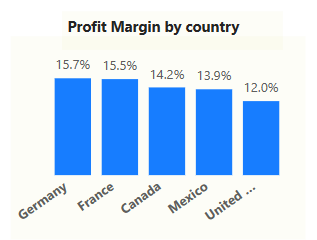
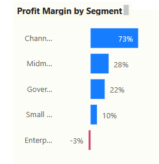
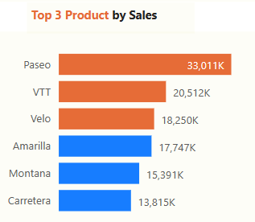

# Power BI Financial Report Analysis

This project involves analyzing financial data using Power BI. The report is focused on sales, orders, profit, and discounts offered for the current year versus the previous year. It also includes a breakdown of orders and profit margin by country and segment.

## Analysis Results

### Total Sales:
* Current Year: 92311,095
* Previous Year: 26415,256

### Total Orders:
* Current Year: 861132
* Previous Year: 264674

### Total Profit:
* Current Year: 13015,238
* Previous Year: 3878465

### Discount Offered:
* Current Year: 7059717
* Previous Year: 2145531

### Orders by Country
* Canada: 247.43K
* France: 240.93K
* United States: 232.63K

### Profit Margin by Country
* Germany: 15.7%
* France: 15.5%
* Mexico: 13.9%
* United States: 12.0%
* Profit Margin by Segment

### Profit margin by segment
* Channel Partners: 73%
* Mid Market: 28%
* Government: 22%
* Small Business: 10%
* Enterprise: -3%

### Top three products by sales

## Conclusion
This financial report analysis highlights significant differences between the current year and the previous year in terms of sales, orders, profit, and discounts offered. Additionally, it provides insights into the performance of different countries and segments. This information can be used to inform future business decisions and strategies.

## How to Use:
The Power BI report used for this analysis can be accessed via [This link](https://app.powerbi.com/groups/me/reports/d723030e-f5ef-4d72-9564-43f49d2cc6fb/ReportSection)

